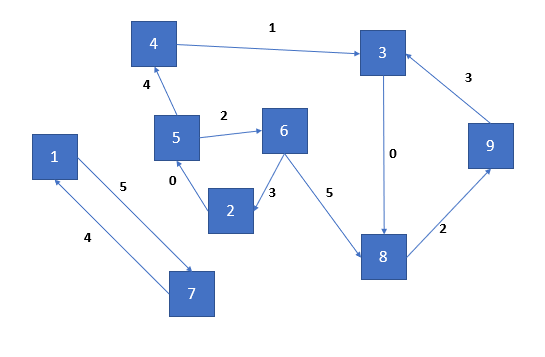

# Database Query Implementations
Implementations of sort-merge join and hash join (as used in RDBMS) algorithms in C.

## Context

The query operates on a graph with uniquely numbered nodes and directed edges which are also uniquely numbered as in the below diagram.



It performs a query that counts the number of edge triangles having a particular sequence of edge numbers. For example, for an edge number sequence of '0,2,3', the result of the query would be 2 for the above diagram.

The graph is represented as a relational database table, with the following schema to represent every edge in the graph.

```

Start Node No.    |       End Node No.    |     Edge No.    |
                  |                       |                 |
                  |                       |                 |
                  
```

The query may then be evaluated by joining copies of the above table based in equality in the columns `Start Node No` and `Edge Node No` (here, the join algorithm implementations are [sort-merge join](https://en.wikipedia.org/wiki/Sort-merge_join) and [hash-join](https://en.wikipedia.org/wiki/Hash_join)).

## The Code

The code is in the [Source](Source) folder:
- [*Implementation.c*](Source/Implementation.c) contains the implementations of both the algorithms. It provides for setting up the database (implemented as an in-memory array encapsulated in a struct), inserting and removing edges. The code is itself highly documented.
- [*Implementation.h*](Source/Implementation.h) provides an external API that a program can use to manipulate the query processing system. There is a set of functions for setting up the database and querying it using sort-merge joins. There is a similar set of functions for doing so with hash-join. The functions whose identifiers contain 'Competition' can be ignored - these currently reimplement hash-join and are intended for further exploration of query processing techniques.
- [*testing.c*](Source/testing.c) is a test of the API offered by *Implementation.h*. It calls the functions to perform queries then outputs the results to the console.

## Prerequisites 

The only prerequisite is a C compiler e.g. GCC.

# How to Run
To run *testing.c*, first compile *testing.c* and *Implementation.c* into object files. 
```
gcc -c testing.c -o test.o
gcc -c Implementation.c -o impl.o
```

Then link the object files:
```
gcc -o executable test.o impl.o
```

Followed by:
`./executable` in Linux/MacOS or
`executable.exe` in Windows.

Alternately, include *Implementation.h* in your C program and use the API.

